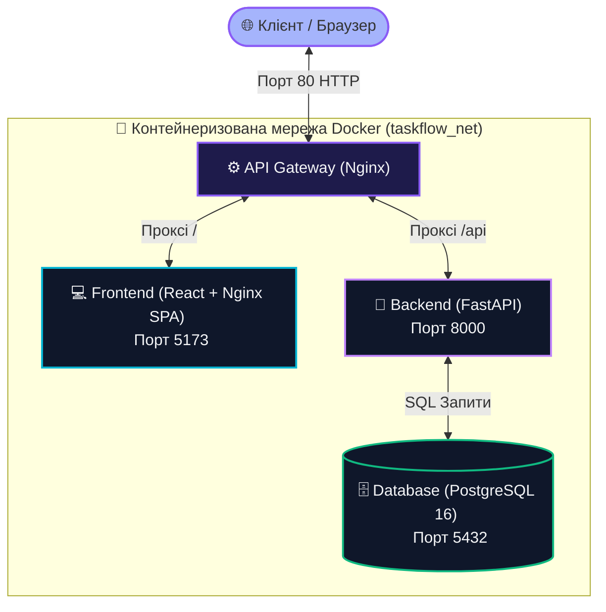

## 1. Вступ та Мета роботи
Головною метою лабораторної роботи було створення повноцінної DevOps-інфраструктури для веб-додатку з використанням сучасних інструментів контейнеризації та автоматизації. Було спроектовано та впроваджено мікросервісну архітектуру з використанням **Docker**, оркестровано роботу кількох контейнерів за допомогою **Docker Compose**, а також налаштовано автоматизований конвеєр тестування та перевірки збірки (**CI/CD**) на базі **GitHub Actions**.

---

## 2. Струтурна схема архітектури (Topology Diagram)
Нижче наведено схему взаємодії компонентів розробленого сервісу **TaskFlow Hub**. Завдяки використанню Nginx як єдиного шлюзу (API Gateway), користувач взаємодіє з усіма сервісами через стандартний HTTP порт `80`:

---

## 3. Основні кроки реалізації та технічні деталі

### Крок 1: Контейнеризація додатків за допомогою Dockerfile
Було розроблено два індивідуальні Docker-файли для кожного з сервісів:
- **FastAPI Бекенд ([backend/Dockerfile](file:///backend/Dockerfile))**: Базується на офіційному образі `python:3.12-slim`. Проводить копіювання коду, встановлює системні та python-залежності з `requirements.txt` і запускає сервер `uvicorn` на порту `8000`.
- **React Фронтенд ([frontend/Dockerfile](file:///frontend/Dockerfile))**: Реалізовано за допомогою **багатоетапної збірки (Multi-stage Build)**. На першому етапі в образі `node:20-alpine` збирається оптимізована продакшн-статика програми (`npm run build`). На другому етапі статика переноситься в надлегкий веб-сервер `nginx:alpine` та налаштовується роутинг для React SPA на порту `5173`.

### Крок 2: Оркестрація за допомогою Docker Compose
У корені проєкту створено файл **[docker-compose.yml](file:///docker-compose.yml)**, який автоматизує запуск наступних служб:
- `db`: База даних PostgreSQL 16. Має вбудовану директиву `healthcheck` (перевірка доступності за допомогою команди `pg_isready`), яка гарантує, що база даних повністю готова до прийому підключень перед запуском бекенду.
- `backend`: Веб-додаток FastAPI, який залежить від успішного проходження перевірки бази даних (`condition: service_healthy`).
- `frontend`: Веб-сервер Nginx зі статикою React.
- `nginx`: Головний реверс-проксі на порту `80`, який маршрутизує запити між фронтендом та бекендом.

### Крок 3: Налаштування автоматизованого CI/CD конвеєру
Створено конфігураційний файл конвеєру **[.github/workflows/ci.yml](file:///.github/workflows/ci.yml)** для сервісу GitHub Actions. Конвеєр складається з двох послідовних етапів (jobs):
1. **Lint & Test Codebase**: Запуск статичного аналізу коду Python за допомогою лінтера `flake8` та автоматичне виконання написаних юніт-тестів за допомогою `pytest` у віртуальному оточенні Ubuntu.
2. **Build & Verify Docker**: Перевірка успішності побудови (build) Docker-образів для фронтенду та бекенду на кожному push/pull-request до репозиторію.

---

## 4. Результати тестування та демонстрація роботи

### 📸 Скріншоти працездатності системи
*(Рекомендується зробити відповідні скріншоти на Вашому комп'ютері та вставити їх у звіт)*

1. **Скріншот роботи контейнерів у Docker Compose (команда `docker ps` або Docker Desktop)**:
   > *[Сюди можна додати Ваш скріншот із терміналу після запуску `docker-compose up` — показує роботу 4-х запущених контейнерів]*
   
2. **Скріншот інтерфейсу додатку (Frontend) у веб-браузері**:
   > *[Сюди можна додати скріншот сторінки http://localhost/ з Вашими створеними завданнями та аналітичною панеллю]*

3. **Скріншот успішного виконання юніт-тестів локально або в CI**:
   > *[Сюди можна додати скріншот запуску `pytest` у папці backend з результатом "4 passed in X seconds"]*

4. **Скріншот успішного проходження CI-пайплайну на GitHub**:
   > *[Сюди можна додати скріншот вкладки Actions у Вашому репозиторії із зеленими галочками біля комміту]*

### 🎥 Демонстраційне відео роботи сервісу
Посилання на коротке демо-відео (або GIF-анімацію), що демонструє роботу додатку (створення завдань, зміна статусів, аналітика) у зв'язці з Docker:
- 🔗 **Посилання на демонстрацію**: [Додайте сюди посилання на Ваше відео/GIF, завантажене на Google Drive, YouTube або GitHub]

---

## 5. Висновки
Під час виконання лабораторної роботи було повністю автоматизовано процес розгортання та перевірки мікросервісного веб-додатку. Впровадження Docker дозволило усунути проблему "працює лише на моєму комп'ютері", забезпечивши ідентичне середовище виконання. Використання Docker Compose суттєво спростило запуск системи, об'єднавши 4 різні компоненти в один спільний стек із керованою черговістю запуску. Завдяки налаштуванню GitHub Actions CI/CD, кожен комміт тепер проходить автоматичну перевірку на синтаксичні помилки та успішне виконання тестів, що мінімізує потрапляння багів у робочий код.
